# WPF
WPF é um framework para desenvolvimento de aplicações desktop no Windows. Ele é baseado no .NET e permite criar interfaces de usuário ricas e interativas. O WPF utiliza o XAML (Extensible Application Markup Language) para definir a interface do usuário, o que facilita a separação entre a lógica de negócios e a apresentação.

## WPF ou Avalonia
WPF é uma tecnologia específica para o Windows, enquanto Avalonia é um framework multiplataforma que permite criar aplicações desktop que podem ser executadas em diferentes sistemas operacionais, como Windows, macOS e Linux. Se você está desenvolvendo uma aplicação que precisa ser executada em várias plataformas, Avalonia pode ser a melhor escolha. No entanto, se você está focado apenas no Windows e deseja aproveitar os recursos específicos do sistema operacional, o WPF é uma excelente opção.

## Estrutura do projeto
O projeto WPF é organizado em várias pastas e arquivos, cada um com uma função específica. Abaixo está uma breve descrição da estrutura típica de um projeto WPF:

- **App.xaml**: Este arquivo contém a definição da aplicação e é o ponto de entrada para o aplicativo WPF. Ele também pode conter recursos globais, como estilos e dicionários de recursos.
- **App.xaml.cs**: Este arquivo contém a lógica de inicialização da aplicação. Ele é gerado automaticamente pelo Visual Studio e contém o código para iniciar a aplicação e carregar a janela principal.
- **MainWindow.xaml**: Este arquivo contém a definição da janela principal da aplicação. Ele é escrito em XAML e define a interface do usuário, incluindo botões, caixas de texto e outros controles.
- **MainWindow.xaml.cs**: Este arquivo contém a lógica de código por trás da janela principal. Ele é gerado automaticamente pelo Visual Studio e contém o código para manipular eventos, como cliques de botão e alterações de texto.

## O que é XAML
XAML (Extensible Application Markup Language) é uma linguagem de marcação usada para definir a interface do usuário em aplicações WPF. Ele permite que os desenvolvedores descrevam a aparência e o comportamento dos controles de forma declarativa, separando a lógica de negócios da apresentação. O XAML é semelhante ao HTML, mas é projetado especificamente para criar interfaces de usuário ricas e interativas em aplicações desktop.

## Apreendendo
### Criando um novo projeto WPF
1. Abra o Visual Studio e clique em "Criar um novo projeto".
2. Selecione "Aplicativo WPF (.NET Core)" ou "Aplicativo WPF (.NET Framework)" e clique em "Avançar".
3. Dê um nome ao seu projeto e escolha um local para salvá-lo. Clique em "Criar".
4. O Visual Studio criará um novo projeto WPF com a estrutura básica de arquivos e pastas.

### Hello World
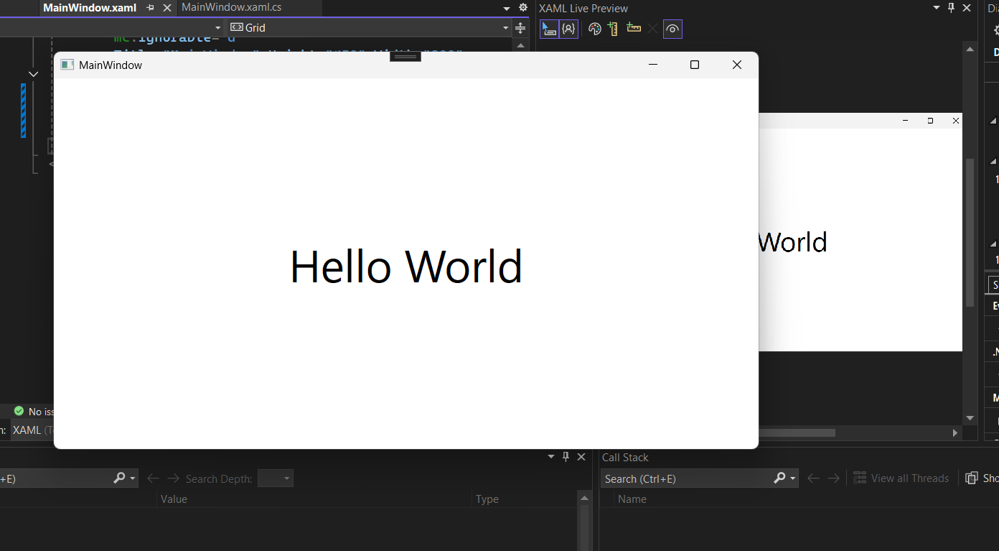

Há duas maneiras de criar e modificar um projeto WPF: Você pode ultilizar a ToolBox do Visual Studio ou pode escrever o código manualmente. A escolha é por preferencia pessoal, muito provavelmente você irá utilizar as duas maneiras em algum momento.
Mesmo que você utilize a ToolBox, você provavelmente terá que modificar o código manualmente em algum momento, então é bom ter uma noção de como funciona.

```xaml
<Window x:Class="WPFTutorial.MainWindow"
        xmlns="http://schemas.microsoft.com/winfx/2006/xaml/presentation"
        xmlns:x="http://schemas.microsoft.com/winfx/2006/xaml"
        xmlns:d="http://schemas.microsoft.com/expression/blend/2008"
        xmlns:mc="http://schemas.openxmlformats.org/markup-compatibility/2006"
        xmlns:local="clr-namespace:WPFTutorial"
        mc:Ignorable="d"
        Title="MainWindow" Height="450" Width="800">
    <Grid>
        <TextBlock Text="Hello World" FontSize="50" HorizontalAlignment="Center" VerticalAlignment="Center"/>
    </Grid>
</Window>
```

### Backend
Para adicionar lógica ao seu projeto, você pode usar o arquivo `MainWindow.xaml.cs`. Este arquivo contém a lógica de código por trás da janela principal. Você pode adicionar métodos, manipuladores de eventos e outras funcionalidades aqui.

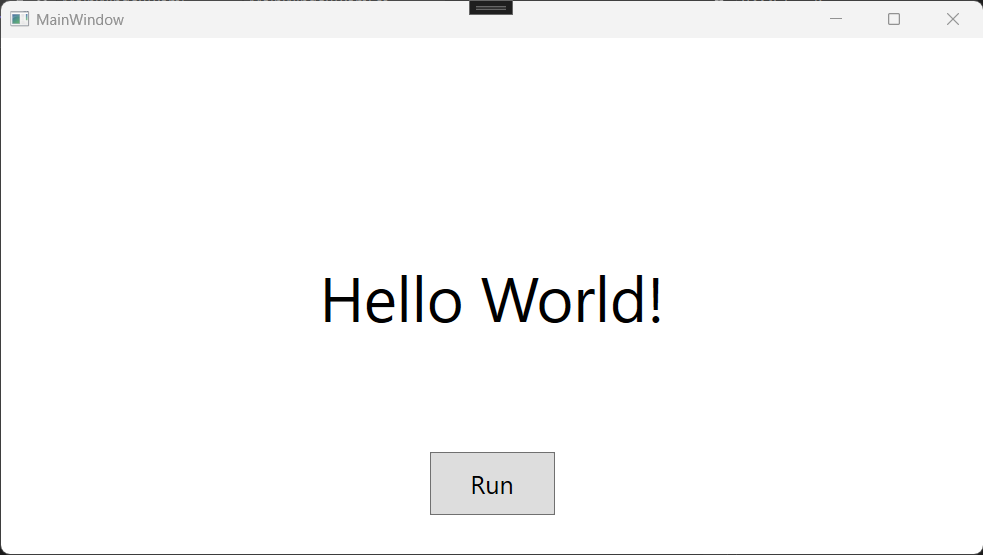
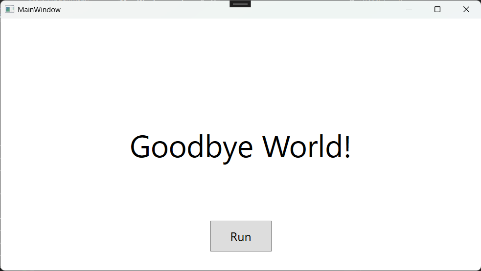

*xaml*
```xaml
<Grid>
    <TextBlock x:Name="tbHello" Text="Hello World!" FontSize="50" HorizontalAlignment="Center" VerticalAlignment="Center"/>
    <Button x:Name="btnRun" Content="Run" Width="100" Height="50" FontSize="20" HorizontalAlignment="Center" Margin="0,300,0,0" VerticalAlignment="Center" Click="btnRun_Click"/>
</Grid>
```

*C#*
```csharp
private void btnRun_Click(object sender, RoutedEventArgs e) {
        if (isRunning) {
            tbHello.Text = "Hello World!";
        } else {
            tbHello.Text = "Goodbye World!";
        }
        isRunning = !isRunning;
}
```

### Grids
O Grid é um dos contêineres mais comuns usados em WPF. Ele permite que você organize os controles em linhas e colunas, facilitando o layout da interface do usuário. Você pode definir a quantidade de linhas e colunas que deseja usar e, em seguida, adicionar controles a essas células.
```xaml
<Grid>
    <Grid.RowDefinitions>
            <RowDefinition/>
            <RowDefinition/>
            <RowDefinition/>
        </Grid.RowDefinitions>
        <Grid.ColumnDefinitions>
            <ColumnDefinition/>
            <ColumnDefinition/>
        </Grid.ColumnDefinitions>

        <Rectangle Grid.Row="0" Grid.Column="0" Fill="Red" Margin="10"/>
        <Rectangle Grid.Row="1" Grid.Column="1" Fill="Green" Margin="10"/>
        <Rectangle Grid.Row="2" Grid.Column="0" Fill="Blue" Margin="10"/>
</Grid>
```

img src="images/Grid.png" alt="Grid" width="400"/>

#### Linhas e Colunas
Você pode definir linhas e colunas no Grid usando as propriedades `RowDefinitions` e `ColumnDefinitions`. Cada linha e coluna pode ter uma altura ou largura fixa, automática ou proporcional. Você pode usar a propriedade `Height` ou `Width` para definir o tamanho de cada linha ou coluna.
```xaml
<Grid>
        <Grid.RowDefinitions>
            <RowDefinition Height="70"/>
            <RowDefinition/>
            <RowDefinition Height="20"/>
        </Grid.RowDefinitions>
        
        <!--Menu Bar-->
        <Rectangle Grid.Row="0" Fill="Red"/>

        <!--Content Pane-->
        <Grid Grid.Row="1">
            <Grid.ColumnDefinitions>
                <ColumnDefinition Width=".2*"/><!--20%-->
                <ColumnDefinition Width=".6*"/>
                <!--Pode ser .6* ou 60*-->
                <ColumnDefinition Width=".2*"/>
            </Grid.ColumnDefinitions>

            <Rectangle Grid.Column="0" Fill="Green"/>
            <Rectangle Grid.Column="1" Fill="Yellow"/>
            <Rectangle Grid.Column="2" Fill="Purple"/>

        </Grid>

        <!--Footer-->
        <Rectangle Grid.Row="2" Fill="Blue"/>
</Grid>
```

As "* " e "Auto" são usados para definir o tamanho proporcional e automático, respectivamente. O "*" significa que a linha ou coluna ocupará o espaço restante disponível na janela. O "Auto" significa que a linha ou coluna terá o tamanho necessário para acomodar seu conteúdo."

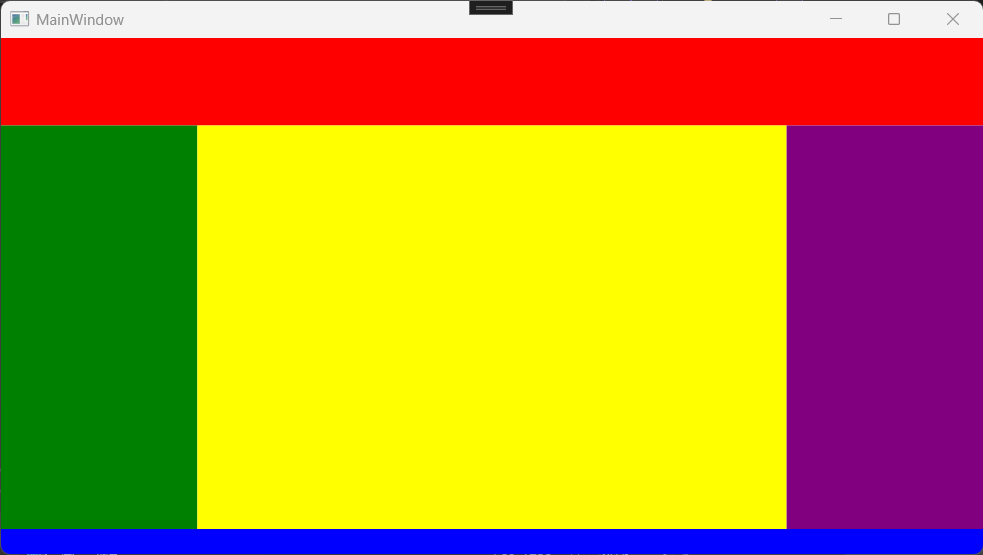>

### UserControls
Os UserControls são uma maneira de criar componentes reutilizáveis em WPF. Eles permitem que você agrupe controles e lógica em um único controle que pode ser usado em várias partes da sua aplicação. Isso ajuda a manter o código organizado e facilita a manutenção.

Para criar um UserControl, clique com o botão direito do mouse na pasta do projeto e selecione "Adicionar" > "Novo Item". Escolha "User Control (WPF)" e dê um nome ao seu controle. O Visual Studio criará dois arquivos: um arquivo XAML para a interface do usuário e um arquivo C# para a lógica de código por trás do controle.

```xaml
<UserControl x:Class="WPFTutorial.View.UserControls.MenuBar"
             xmlns="http://schemas.microsoft.com/winfx/2006/xaml/presentation"
             xmlns:x="http://schemas.microsoft.com/winfx/2006/xaml"
             xmlns:mc="http://schemas.openxmlformats.org/markup-compatibility/2006" 
             xmlns:d="http://schemas.microsoft.com/expression/blend/2008" 
             xmlns:local="clr-namespace:WPFTutorial.View.UserControls"
             mc:Ignorable="d" 
             Height="70" d:DesignWidth="800">
    <Grid>
        <Grid.RowDefinitions>
            <RowDefinition Height="30"/>
            <RowDefinition Height="40"/>
        </Grid.RowDefinitions>

        <Menu>
            <MenuItem Header="File" FontSize="16">
                <MenuItem Header="Exit" FontSize="16"/>
            </MenuItem>
            <MenuItem Header="Edit" FontSize="16"/>
        </Menu>

        <Grid Grid.Row="1">
            <Grid.ColumnDefinitions>
                <ColumnDefinition Width="auto"/>
                <ColumnDefinition Width="auto"/>
            </Grid.ColumnDefinitions>

            <Button Width="50" Margin="5"/>
            <TextBox Width="150" Grid.Column="1" Margin="5"/>
        </Grid>
    </Grid>
</UserControl>
```

Para usar o UserControl em sua aplicação, você pode copiar o xmlns:local, que é o namespace do UserControl, e colar no arquivo XAML onde você deseja usar o controle. Em seguida, mude o nome de local para o nome do userControl.
Depois basta colocar a tag do UserControl no local desejado.

```xaml
<Window x:Class="WPFTutorial.MainWindow"
        xmlns="http://schemas.microsoft.com/winfx/2006/xaml/presentation"
        xmlns:x="http://schemas.microsoft.com/winfx/2006/xaml"
        xmlns:d="http://schemas.microsoft.com/expression/blend/2008"
        xmlns:mc="http://schemas.openxmlformats.org/markup-compatibility/2006"
        xmlns:local="clr-namespace:WPFTutorial"
        xmlns:userControls="clr-namespace:WPFTutorial.View.UserControls"
        mc:Ignorable="d"
        Title="MainWindow" Height="450" Width="800">
    <Grid>
        <Grid.RowDefinitions>
            <RowDefinition Height=".2*"/>
            <RowDefinition Height=".7*"/>
            <RowDefinition Height=".1*"/>
        </Grid.RowDefinitions>

        <userControls:MenuBar/>
    </Grid>
</Window>
```

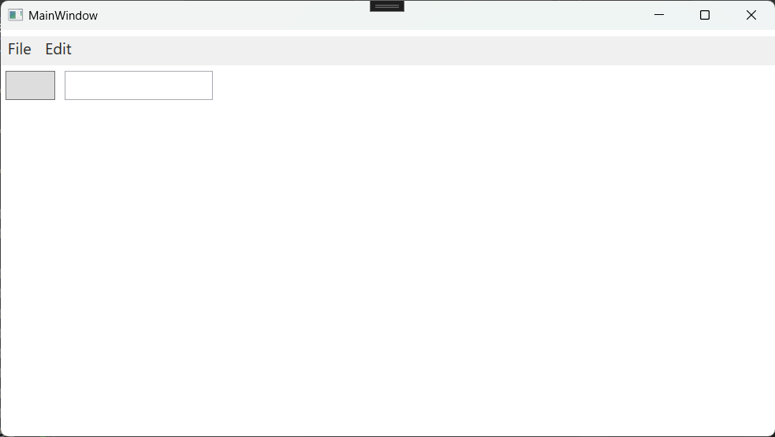

### Message Box
O MessageBox é uma janela de diálogo que exibe uma mensagem para o usuário e pode conter botões para interação. Ele é útil para exibir informações, avisos ou erros. Você pode personalizar o título, o texto e os botões exibidos na caixa de mensagem.

```csharp
private void btnFire_Click(object sender, RoutedEventArgs e) {
        MessageBox.Show("Button Clicket");
        //MessageBox.Show("Could not open file.","Error", MessageBoxButton.OK, MessageBoxImage.Error);
    }
```
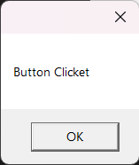

#### Customizando o MessageBox
Você pode personalizar o MessageBox para exibir diferentes botões e ícones. Os botões disponíveis incluem `OK`, `Cancel`, `Yes`, `No` e combinações deles. Você também pode definir o ícone exibido na caixa de mensagem, como `Information`, `Warning` ou `Error`.
```csharp
private void btnFire_Click(object sender, RoutedEventArgs e) {
        MessageBox.Show("Could not open file.","Error", MessageBoxButton.OK, MessageBoxImage.Error);
}
```
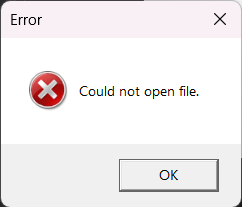

```csharp
private void btnFire_Click(object sender, RoutedEventArgs e) {
        //MessageBox.Show("Could not open file.","Error", MessageBoxButton.OK, MessageBoxImage.Error);

        MessageBoxResult result = MessageBox.Show("Do you agree?", "Agreement", MessageBoxButton.YesNo, MessageBoxImage.Question);

        if (result == MessageBoxResult.Yes) {
            tbInfo.Text = "You agreed.";
        } else {
            tbInfo.Text = "You disagreed.";
        }
}
```
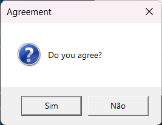

### OpenFile Dialog
O OpenFileDialog é uma janela de diálogo que permite ao usuário selecionar um arquivo do sistema de arquivos. Ele é útil para abrir arquivos, como documentos, imagens ou outros tipos de dados. Você pode personalizar o filtro de arquivos exibidos na caixa de diálogo e definir o diretório inicial.
```csharp
private void btnFire_Click(object sender, RoutedEventArgs e) {
        OpenFileDialog openFileDialog = new OpenFileDialog();
        openFileDialog.Filter = "Text files (*.txt)|*.txt|All files (*.*)|*.*| CS Source Files | *.cs";
        //openFileDialog.InitialDirectory = "C:\";
        openFileDialog.Title = "Select a file";
        //openFileDialog.Multiselect = true;

        bool? sucess = openFileDialog.ShowDialog();
        if (sucess == true) {
            string path = openFileDialog.FileName;
            string fileName = openFileDialog.SafeFileName;
            //string[] paths = openFileDialog.FileNames;
            //string[] fileNames = openFileDialog.SafeFileNames;

            MessageBox.Show($"You selected: {path}");
            tbInfo.Text = fileName;
        } else {
            MessageBox.Show("No file selected");
        }
    }
```

### ListView
O ListView é um controle que exibe uma lista de itens, permitindo que o usuário selecione um ou mais itens. Ele é útil para exibir dados em formato de lista, como contatos, arquivos ou qualquer outra coleção de objetos. O ListView pode ser personalizado para exibir diferentes tipos de dados e pode incluir colunas, ícones e outros elementos visuais.

*XAML*
```xaml
<Window x:Class="WPFTutorial.MainWindow"  
       xmlns="http://schemas.microsoft.com/winfx/2006/xaml/presentation"  
       xmlns:x="http://schemas.microsoft.com/winfx/2006/xaml"  
       xmlns:d="http://schemas.microsoft.com/expression/blend/2008"  
       xmlns:mc="http://schemas.openxmlformats.org/markup-compatibility/2006"  
       xmlns:local="clr-namespace:WPFTutorial"  
       mc:Ignorable="d"  
       Title="MainWindow" Height="400" Width="400">  
   <Grid>  
       <Grid.RowDefinitions>
            <RowDefinition Height="75"/>
            <RowDefinition/>
        </Grid.RowDefinitions>

        <Grid.ColumnDefinitions>
            <ColumnDefinition/>
            <ColumnDefinition/>
        </Grid.ColumnDefinitions>

        <TextBox Name="txtEntry" Height="35" FontSize="16"/>
        <Button Grid.Column="1" Name="btnAdd" Content="Add" Height="35" Width="50" Click="btnAdd_Click" HorizontalAlignment="Left"/>
        <Button Grid.Column="1" Name="btnDelete" Content="Delete" Height="35" Width="50" HorizontalAlignment="Center" Click="btnDelete_Click"/>
        <Button Grid.Column="1" Name="btnClear" Content="Clear" Height="35" Width="50" HorizontalAlignment="Right" Click="btnClear_Click"/>

        <ListView Name="lvEntreis" Grid.Row="1" Grid.ColumnSpan="2" SelectionMode="Single"/>

    </Grid>  
</Window>
```

*CS*

```csharp
using System.Windows;
using System.Windows.Controls;

namespace WPFTutorial;

public partial class MainWindow : Window {
    public MainWindow() {
        InitializeComponent();

        // Default list for testing
        lvEntreis.Items.Add(new ListViewItem()
        {
            Content = new TextBlock()
            {
                Text = "Test 1",
                FontSize = 20
            }
        });
        lvEntreis.Items.Add(new ListViewItem()
        {
            Content = new TextBlock()
            {
                Text = "Test 2",
                FontSize = 20
            }
        });
        lvEntreis.Items.Add(new ListViewItem()
        {
            Content = new TextBlock()
            {
                Text = "Test 3",
                FontSize = 20
            }
        });
        lvEntreis.Items.Add(new ListViewItem()
        {
            Content = new TextBlock()
            {
                Text = "Test 4",
                FontSize = 20
            }
        });
        lvEntreis.Items.Add(new ListViewItem()
        {
            Content = new TextBlock()
            {
                Text = "Test 5",
                FontSize = 20
            }
        });
    }

    private void btnAdd_Click(object sender, RoutedEventArgs e) {
        if (string.IsNullOrWhiteSpace(txtEntry.Text)) {
            return;
        }
        lvEntreis.Items.Add(new ListViewItem()
        {
            Content = new TextBlock()
            {
                Text = txtEntry.Text,
                FontSize = 20
            }
        });
        txtEntry.Clear();
    }

    private void btnDelete_Click(object sender, RoutedEventArgs e) {
       //Erro
        /*var items = lvEntreis.SelectedItem; ;

        if (items != null) {
            var selectedItems = lvEntreis.SelectedItems.Cast<ListViewItem>().ToList();
            foreach (var item in selectedItems) {
                lvEntreis.Items.Remove(item);
            }
        }*/

        object selectedItem = lvEntreis.SelectedItem;

        if (selectedItem != null) {
            lvEntreis.Items.Remove(selectedItem);
        }


        // Whats is better?
        /*
         int index = lvEntreis.SelectedIndex;
            if (index != -1) {
                lvEntreis.Items.RemoveAt(index);
            }
         */
        // Or this?
        /*if (lvEntreis.SelectedItem != null) {
            lvEntreis.Items.Remove(lvEntreis.SelectedItem);
        }*/
        // Or this?
        /*
        object selectedItem = lvEntreis.SelectedItem;
        if (selectedItem != null) {
            lvEntreis.Items.Remove(selectedItem);
        }*/
        // Answer: The first one is better because it uses the index to remove the item, which is more efficient than searching for the item in the list. The second and third options are less efficient because they require searching for the item in the list, which can be slower if the list is large.
    }

    private void btnClear_Click(object sender, RoutedEventArgs e) {
        lvEntreis.Items.Clear();
    }
}
```

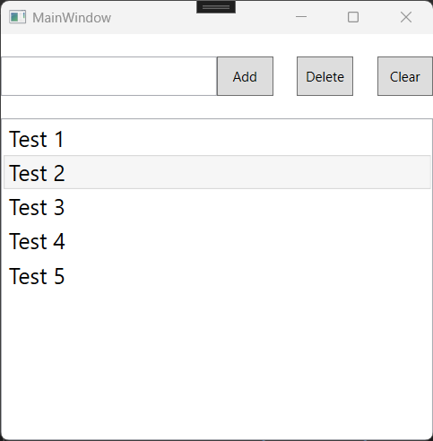

#### ListViewItem
O ListViewItem é um item individual dentro de um ListView. Ele pode conter texto, imagens ou outros controles. Você pode personalizar a aparência do ListViewItem usando estilos e templates. O ListViewItem também pode ser selecionado, permitindo que o usuário interaja com ele.
```csharp
private void btnAdd_Click(object sender, RoutedEventArgs e) {
        if (string.IsNullOrWhiteSpace(txtEntry.Text)) {
            return;
        }
        lvEntreis.Items.Add(new ListViewItem()
        {
            Content = new TextBlock()
            {
                Text = txtEntry.Text,
                FontSize = 20
            }
        });
        txtEntry.Clear();
    }
```

#### ObservableCollection
A ObservableCollection é uma coleção que notifica a interface do usuário quando itens são adicionados, removidos ou alterados. Isso é útil para manter a interface do usuário sincronizada com os dados subjacentes. Quando você usa uma ObservableCollection como fonte de dados para um ListView, a interface do usuário é atualizada automaticamente quando os dados mudam.
A ObservableCollection é uma classe que implementa a interface INotifyCollectionChanged, o que significa que ela pode notificar a interface do usuário quando os itens são alterados. Isso é útil para manter a interface do usuário sincronizada com os dados subjacentes. Quando você usa uma ObservableCollection como fonte de dados para um ListView, a interface do usuário é atualizada automaticamente quando os dados mudam.

*CS*
```csharp
using System.Collections.ObjectModel;
using System.Windows;
using System.Windows.Controls;

namespace WPFTutorial;

public partial class MainWindow : Window {
    public MainWindow() {
        DataContext = this;
        entries = new ObservableCollection<string> {
            "Entry 1",
            "Entry 2",
            "Entry 3"
        };

        InitializeComponent();
    }

    private ObservableCollection<string> entries;

    public ObservableCollection<string> Entries {
        get { return entries; }
        set { entries = value; }
    }


    private void btnAdd_Click(object sender, RoutedEventArgs e) {
        if (!string.IsNullOrWhiteSpace(txtEntry.Text)) {
            entries.Add(txtEntry.Text);
            txtEntry.Clear();
        }
    }

    private void btnDelete_Click(object sender, RoutedEventArgs e) {
        if (lvEntreis.SelectedItem != null) {
            entries.Remove(lvEntreis.SelectedItem.ToString());
        }
    }

    private void btnClear_Click(object sender, RoutedEventArgs e) {
        entries.Clear();
    }
}
```
*Xaml*

```xaml
<ListView Name="lvEntreis" Grid.Row="1" Grid.ColumnSpan="2" ItemsSource="{Binding Entries}"/>
```
### Data Binding
O Data Binding é um recurso poderoso do WPF que permite vincular propriedades de controles de interface do usuário a propriedades de objetos de dados. Isso facilita a atualização automática da interface do usuário quando os dados mudam e vice-versa. O Data Binding é amplamente utilizado em aplicações WPF para criar interfaces dinâmicas e responsivas.

#### Binding
O Binding é o processo de vincular uma propriedade de um controle a uma propriedade de um objeto de dados. Isso permite que você exiba e edite dados na interface do usuário sem precisar escrever muito código. O WPF suporta vários tipos de binding, incluindo OneWay, TwoWay e OneTime.
```xaml
<TextBox Name="txtEntry" Height="35" FontSize="16" Text="{Binding Path=Text, ElementName=tbInfo, Mode=TwoWay}"/>
```
```csharp
private void btnFire_Click(object sender, RoutedEventArgs e) {
        tbInfo.Text = txtEntry.Text;
    }
```

```csharp
private void btnFire_Click(object sender, RoutedEventArgs e) {
        tbInfo.Text = txtEntry.Text;
        txtEntry.Clear();
    }
```

### StackPanel
O StackPanel é um contêiner que organiza os controles em uma única linha ou coluna. Ele é útil para criar layouts simples e flexíveis. Você pode definir a orientação do StackPanel como horizontal ou vertical, dependendo de como deseja organizar os controles.
```xaml
<Window x:Class="WPFTutorial.MainWindow"  
       xmlns="http://schemas.microsoft.com/winfx/2006/xaml/presentation"  
       xmlns:x="http://schemas.microsoft.com/winfx/2006/xaml"  
       xmlns:d="http://schemas.microsoft.com/expression/blend/2008"  
       xmlns:mc="http://schemas.openxmlformats.org/markup-compatibility/2006"  
       xmlns:local="clr-namespace:WPFTutorial"  
       mc:Ignorable="d"  
       Title="MainWindow" Height="400" Width="400">  
   <Grid>  
       <Grid.RowDefinitions>
            <RowDefinition Height="75"/>
            <RowDefinition/>
        </Grid.RowDefinitions>

        <StackPanel Orientation="Horizontal" HorizontalAlignment="Center">
            <Button Width="100" Height="30" Margin="2" Content="Button 1"/>
            <Button Width="100" Height="30" Margin="2" Content="Button 2"/>
            <Button Width="100" Height="30" Margin="2" Content="Button 3"/>
        </StackPanel>

        <StackPanel Grid.Row="1" Margin="20">
            <StackPanel Orientation="Horizontal" HorizontalAlignment="Center">
                <Label Content="Label:"/>
                <TextBox Width="150"/>
                <Button Content="GO"/>
            </StackPanel>
            <StackPanel Orientation="Horizontal" HorizontalAlignment="Center">
                <Label Content="Label:"/>
                <TextBox Width="150"/>
                <Button Content="GO"/>
            </StackPanel>
            <StackPanel Orientation="Horizontal" HorizontalAlignment="Center">
                <Label Content="Label:"/>
                <TextBox Width="150"/>
                <Button Content="GO"/>
            </StackPanel>

            <TextBox Width="150" Height="30" Margin="2"/>
            <ComboBox Width="150" Height="30" Margin="2"/>
            <TextBox Width="150" Height="30" Margin="2"/>
            <TextBox Width="150" Height="30" Margin="2"/>
            <TextBox Width="150" Height="30" Margin="2"/>
            <TextBox Width="150" Height="30" Margin="2"/>
        </StackPanel>

    </Grid>  
</Window>
```
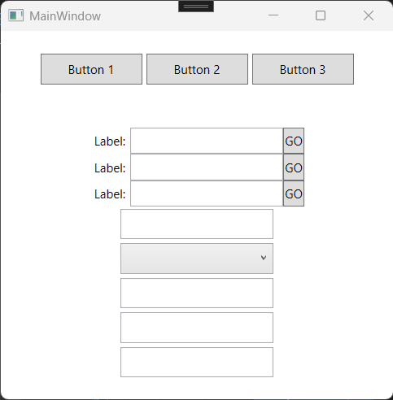

### GridSplitter
O GridSplitter é um controle que permite ao usuário redimensionar linhas e colunas em um Grid. Ele é útil para criar layouts flexíveis onde o usuário pode ajustar o tamanho dos controles conforme necessário. O GridSplitter pode ser arrastado para aumentar ou diminuir o tamanho das linhas ou colunas adjacentes.
```xaml
<Window x:Class="WPFTutorial.MainWindow"  
       xmlns="http://schemas.microsoft.com/winfx/2006/xaml/presentation"  
       xmlns:x="http://schemas.microsoft.com/winfx/2006/xaml"  
       xmlns:d="http://schemas.microsoft.com/expression/blend/2008"  
       xmlns:mc="http://schemas.openxmlformats.org/markup-compatibility/2006"  
       xmlns:local="clr-namespace:WPFTutorial"  
       mc:Ignorable="d"  
       Title="MainWindow" Height="400" Width="400">  
   <Grid>
        <Grid.RowDefinitions>
            <RowDefinition Height="50"/>
            <RowDefinition/>
            <RowDefinition Height="5"/>
            <RowDefinition Height="10"/>
        </Grid.RowDefinitions>

        <Rectangle Fill="Red"/>

        <Grid Grid.Row="1">
            <Grid.ColumnDefinitions>
                <ColumnDefinition/>
                <ColumnDefinition Width="5"/>
                <ColumnDefinition/>
                <ColumnDefinition Width="5"/>
                <ColumnDefinition/>
            </Grid.ColumnDefinitions>
            <Rectangle Fill="Green" Grid.Column="0"/>
            <GridSplitter Grid.Column="1" HorizontalAlignment="Stretch"/>
            <Rectangle Fill="Yellow" Grid.Column="2"/>
            <GridSplitter Grid.Column="3" HorizontalAlignment="Stretch"/>
            <Rectangle Fill="Green" Grid.Column="4"/>
        </Grid>

        <GridSplitter Grid.Row="2" HorizontalAlignment="Stretch"/>

        <Rectangle Fill="Blue" Grid.Row="3"/>

    </Grid>  
</Window>
```
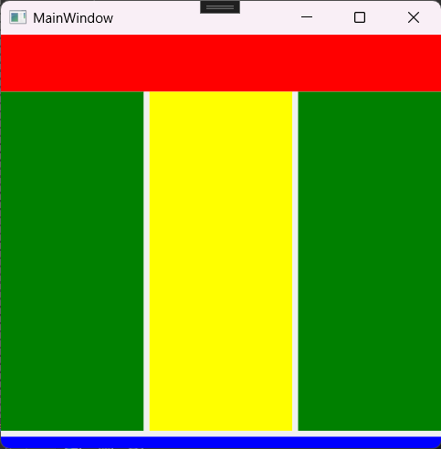

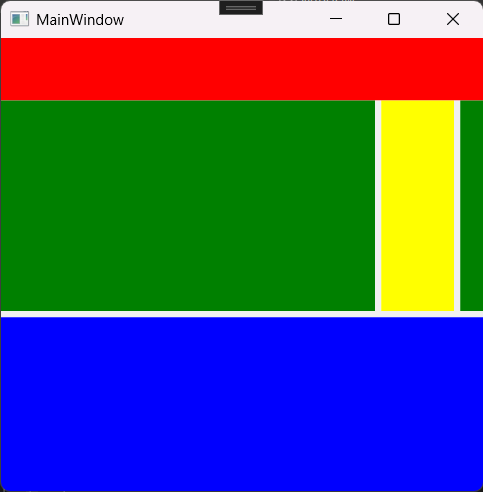

### Expander
O Expander é um controle que permite expandir ou recolher conteúdo adicional. Ele é útil para ocultar ou mostrar informações extras, como detalhes ou opções adicionais. O Expander pode conter qualquer tipo de controle, como TextBlock, StackPanel ou outros controles.
```xaml
<Grid>
        <Grid.ColumnDefinitions>
            <ColumnDefinition/>
            <ColumnDefinition Width="auto"/>
        </Grid.ColumnDefinitions>
       
        <StackPanel>
            <TextBlock Text="Name" FontSize="16"/>
            <Expander Header="More Details">
                <TextBlock Text="Description" FontSize="16"/>
            </Expander>
            <Button x:Name="btnDetails" Content="Details" Width="100" Height="30" Margin="5" Click="btnDetails_Click"/>
        </StackPanel>

        <Expander Name="ExpanderDetails" Grid.Column="1" ExpandDirection="Left" Background="DarkGray" BorderThickness="0">
            <Rectangle Fill="DarkGray" Width="125"/>
        </Expander>

</Grid>
```

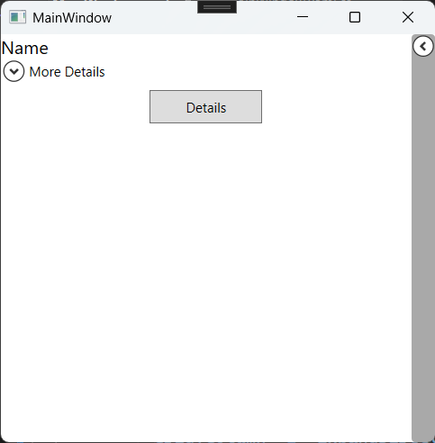

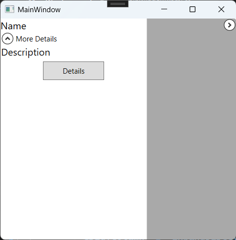

### ScrollViewer
O ScrollViewer é um controle que permite rolar o conteúdo quando ele excede o tamanho visível. Ele é útil para exibir grandes quantidades de dados ou conteúdo que não cabem na tela. O ScrollViewer pode conter qualquer tipo de controle e pode ser configurado para rolar horizontalmente, verticalmente ou em ambas as direções.
```xaml
<Window x:Class="WPFTutorial.MainWindow"  
       xmlns="http://schemas.microsoft.com/winfx/2006/xaml/presentation"  
       xmlns:x="http://schemas.microsoft.com/winfx/2006/xaml"  
       xmlns:d="http://schemas.microsoft.com/expression/blend/2008"  
       xmlns:mc="http://schemas.openxmlformats.org/markup-compatibility/2006"  
       xmlns:local="clr-namespace:WPFTutorial"  
       mc:Ignorable="d"  
       Title="MainWindow" Height="350" Width="300">  
   <Grid>
        <ScrollViewer VerticalScrollBarVisibility="Auto" HorizontalScrollBarVisibility="Auto">
            <StackPanel>
                <TextBox Width="200" Height="30" Margin="10" />
                <TextBox Width="200" Height="30" Margin="10" />
                <TextBox Width="200" Height="30" Margin="10" />
                <TextBox Width="200" Height="30" Margin="10" />
                <TextBox Width="200" Height="30" Margin="10" />
                <TextBox Width="200" Height="30" Margin="10" />
            </StackPanel>
        </ScrollViewer>
    </Grid>  
</Window>
```
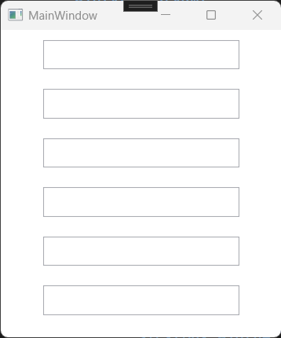
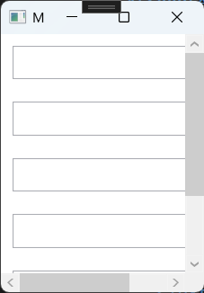